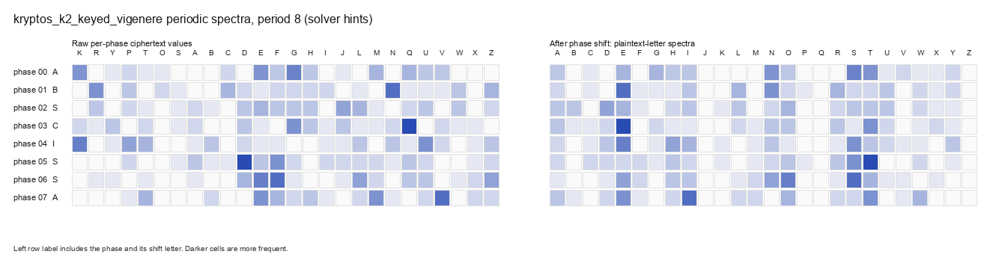
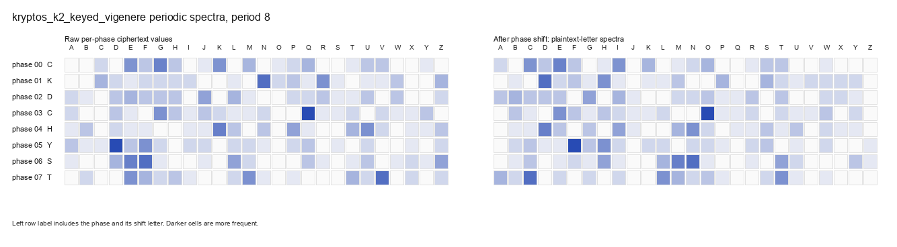

# Kryptos K2 Research Notes

These notes capture the current Decipher experiments on Kryptos K2 keyed
Vigenere/tableau recovery.

## Current Understanding

Kryptos K1/K2 are not ordinary Vigenere ciphers over `A-Z`. They use a
periodic key over a keyed tableau. For K2, the known solution uses:

- Periodic key: `ABSCISSA`
- Key length: `8`
- Keyed alphabet/tableau row: `KRYPTOSABCDEFGHIJLMNQUVWXZ`

Decipher can replay and score this known configuration correctly. The active
research question is whether Decipher can recover the keyed alphabet/tableau
without being given the keyword or solution-bearing hints.

## Candidate Search Results

The Rust fast scorer can recognize good K2 candidates when they are present.
A solution-bearing tableau perturbation control injected the true tableau plus
nearby random swap perturbations. In that setting:

- Exact tableau and exact key ranked first.
- One-swap tableau perturbations ranked immediately behind it.
- Score/character-accuracy correlation was strong enough for this diagnostic.

This means the current blocker is not primarily scoring. It is candidate
generation: blind generators are not yet producing candidates close enough to
the true keyed alphabet.

The blind generators tried so far include:

- Guided shared-tableau annealing from ordinary `A-Z`.
- Phase-frequency constraint starts.
- Random modular offset-graph starts.
- Beam-searched modular constraint graphs.

The best blind screens have reached only about `34%` character accuracy and
remain roughly `21+` tableau positions away from the true keyed alphabet. That
is too far for the current local search to refine reliably.

## External Reference Solver

We cloned Sam Blake's MIT-licensed polyalphabetic solver into:

`other_tools/stblake-polyalphabetic`

Its K2 Quagmire III path is a useful working reference. With no crib and no
explicit `KRYPTOS` keyword, a constrained run using the same broad assumptions
we are willing to make:

- Cipher family: Quagmire III
- Plaintext/ciphertext keyed alphabets tied together
- Keyed-alphabet keyword length: `7`
- Periodic cycleword length: `8`
- English quadgram/dictionary scoring

recovers the known K2 solution:

```text
KRYPTOSABCDEFGHIJLMNQUVWXZ
KRYPTOSABCDEFGHIJLMNQUVWXZ
ABSCISSA
ITWASTOTALLYINVISIBLEHOWSTHATPOSSIBLE...
```

Command used:

```bash
cd other_tools/stblake-polyalphabetic
./polyalphabetic \
  -type quag3 \
  -cipher ciphers/kryptos/K2.txt \
  -ngramsize 4 \
  -ngramfile english_quadgrams.txt \
  -nhillclimbs 500 \
  -nrestarts 1000 \
  -backtrackprob 0.15 \
  -plaintextkeywordlen 7 \
  -cyclewordlen 8
```

Important difference from Decipher's current blind experiments: this solver is
not searching arbitrary 26-letter tableaux. It searches a keyed-alphabet state
space with Quagmire-specific mutations, derives or optimizes the cycleword, and
uses word/dictionary evidence in addition to n-grams. That is the likely source
of the gap.

## Decipher Port Status

The first Decipher Quagmire slice is now in place:

- `analysis.polyalphabetic.replay_quagmire` decodes known-parameter Quagmire
  I-IV style tableaux, with Kryptos-style Quagmire III covered by one shared
  keyed alphabet and a cycleword.
- `analysis.polyalphabetic.encode_quagmire_plaintext` provides the matching
  encoder for tests and synthetic fixtures.
- The automated runner accepts Quagmire known-parameter hints and records
  `quag3_known_replay`, `QuagmireKey`, alphabets, cycleword, and attribution in
  the artifact step.
- `DECIPHER_KEYED_VIGENERE_MODE=quagmire_search` adds the first bounded search
  scaffold: it searches keyword-shaped Quagmire III alphabets with a cheap
  screen hill climb, then derives the best cycleword for a finalist set. In
  the current calibration, seeding `KRYPTOS` as an initial keyword lets
  Decipher derive `ABSCISSA` and recover K2; near-keyword variants also rank
  close behind it. This is still not blind tableau-keyword recovery.
- Finalist ranking now includes strict continuous-word hits. This is weaker
  than Blake's full dictionary/scoring stack, but it is much less permissive
  than Viterbi segmentation on arbitrary gibberish.
- Dictionary-derived keyword starts are available through
  `DECIPHER_QUAGMIRE_DICTIONARY_STARTS`, and they work on synthetic Quagmire
  cases with ordinary dictionary keywords. They do not make K2 blind-recoverable
  yet because the bundled English dictionary does not contain `KRYPTOS`.
- Calibration runs can set `DECIPHER_QUAGMIRE_CALIBRATION_KEYWORD=KRYPTOS` to
  record exact prefix rank and best prefix distance without steering search.
  Current small blind probes still remain several prefix positions away from
  `KRYPTOS`; seeded probes rank the exact prefix first.
- Broad Quagmire prefix-search experiments should use
  `eval/scripts/capture_quagmire_candidates.py`, which checkpoints JSON
  artifacts with per-seed summaries, candidate previews, character accuracy,
  and calibration prefix-distance labels.

This is still not a full port of Sam Blake's stochastic Quagmire search
strategy. The remaining gap is the hard part: produce the right keyword-shaped
alphabet without seeding it, at scale, with better restart/backtracking and
word evidence. Keep the MIT license attribution explicit as deeper strategy
pieces are ported.

## Frequency Spectra Diagrams

The diagrams below split K2 into 8 buckets by position modulo the candidate
period. Each bucket contains the ciphertext positions that would share one
periodic key shift.

### Solution-Bearing View

Files:

- `kryptos_k2_period8_solver_hints.png`
- `kryptos_k2_period8_solver_hints.json`

This view uses the known K2 keyed alphabet and key. It is not blind.

- Left grid: raw bucket frequencies, with columns ordered by the true Kryptos
  keyed alphabet.
- Right grid: the same buckets after undoing the true `ABSCISSA` shifts,
  shown as plaintext-letter frequencies.

The right grid has visible English-like frequency structure because the true
tableau and shifts have been applied.



### Blind Estimated View

Files:

- `kryptos_k2_period8_estimated.png`
- `kryptos_k2_period8_estimated.json`

This view assumes only period `8` and ordinary `A-Z`. It does not use
`ABSCISSA` or the Kryptos keyed alphabet.

- Left grid: raw bucket frequencies over ordinary ciphertext letters `A-Z`.
- Right grid: each bucket shifted by a best frequency-analysis guess under the
  ordinary Vigenere assumption.

This is closer to what a blind ordinary-Vigenere solver sees. It is misleading
for K2 because the true cipher uses a keyed alphabet.



## Next Practical Directions

Pure arbitrary-tableau recovery is currently too unconstrained. More promising
directions are:

- Study and port the Quagmire III keyed-alphabet search strategy from
  `stblake-polyalphabetic`, with attribution and MIT license notice preserved.
- Large keyword-tableau search using historically plausible Kryptos/CIA/art
  vocabulary.
- Better candidate generation from partial plaintext coherence rather than
  crude per-phase frequency ranks alone.
- A medium-cost reranking stage over larger noisy populations once candidate
  generation can produce semi-readable basins.
- Agent-facing tools that can compare keyed-Vigenere hypotheses, inspect
  phase spectra, and request targeted keyword/tableau searches.
